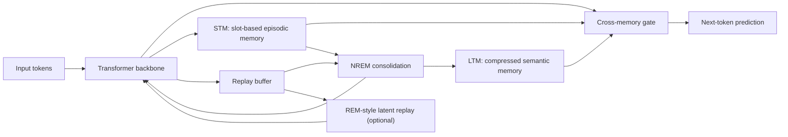

# DreamFormer

DreamFormer is a research architecture for sequence modeling that combines two explicit memory systems with an offline consolidation loop:

- A fast, high-fidelity episodic memory for recent and exact experiences.
- A slow, compressed semantic memory for durable abstractions.
- A replay-and-consolidation process that transfers useful information from the episodic store into the semantic store.

The original concept note is ambitious and directionally interesting. This spec narrows it into something that can be implemented, debugged, and falsified.

## Project thesis

Standard transformers force one parameterized system to do two conflicting jobs:

- Learn specific new events quickly.
- Preserve broad statistical knowledge without interference.

DreamFormer splits those jobs:

- `STM` handles fast writes and exact recall.
- `LTM` handles slow writes and compressed reuse.
- `Dream phases` decide what should move from `STM` into `LTM`.

The core claim is not "human-like memory." The core claim is narrower and testable:

> A dual-memory transformer with selective offline consolidation should improve long-range recall and continual retention at a fixed compute and parameter budget.

## Design goals

- Improve exact retrieval of recent, sparse, or rare events.
- Reduce catastrophic forgetting during sequential training.
- Preserve bounded online memory cost.
- Separate fast adaptation from slow semantic consolidation.
- Make every major subsystem measurable with ablations.

## Non-goals

- Claiming biological fidelity beyond loose inspiration.
- Claiming exascale practicality before systems benchmarks exist.
- Replacing standard transformer pretraining end to end on day one.
- Requiring REM-style latent dreaming for the minimum viable system.

## Architecture summary



## Core components

### 1. Transformer backbone

The backbone remains a standard autoregressive transformer. DreamFormer should be introduced at one or two memory-augmented layers first, not throughout the stack. That keeps the first implementation debuggable and makes attribution easier during ablations.

Recommended initial setup:

- Inject memory after an upper-middle layer.
- Read from both `STM` and `LTM` at that layer.
- Keep the rest of the network unchanged.

### 2. Short-term memory (`STM`)

`STM` is an external slot memory optimized for exact, recent, and ordered retrieval.

Requirements:

- Fast writes during normal sequence processing.
- Sparse access to avoid smearing unrelated episodes together.
- Explicit slot reuse and deallocation.
- Optional temporal links for sequence replay.

Pragmatic design choice:

- Start with DNC-style content lookup and slot allocation.
- Treat temporal links as a second-stage feature, not a day-one dependency.

Reasoning:

- Content lookup and slot management are the high-value parts.
- Full temporal traversal adds complexity and failure modes early.

### 3. Long-term memory (`LTM`)

`LTM` is a compressed associative memory that stores durable, reusable structure instead of exact episodes.

Requirements:

- Fixed or slowly growing memory footprint.
- Read efficiency during inference.
- Slow updates gated by consolidation, not direct online writes.

Pragmatic design choice:

- Use a linear-associative or delta-rule style memory update.
- Restrict writes to offline consolidation windows.

Reasoning:

- Online writes into `LTM` blur the separation between fast and slow learning.
- Sleep-only `LTM` updates make the architecture easier to reason about experimentally.

### 4. Replay buffer

The replay buffer stages candidate experiences for consolidation.

Each buffer entry should minimally store:

- Key and value representation from the memory layer.
- Loss or surprise estimate.
- Timestep or age.
- Access count or reuse count.
- Source task or domain identifier if doing continual learning.

Sampling policy:

- Start with proportional prioritized replay.
- Add reducible-loss filtering only after a uniform-vs-prioritized baseline exists.

Reasoning:

- Prioritized replay is already testable.
- Reducible-loss estimation adds another learned dependency and should not be required for the first milestone.

### 5. Cross-memory gate

The gate blends `STM` and `LTM` outputs at inference time.

Requirements:

- Per-head or per-layer mixing coefficient.
- Logging to detect collapse into "all STM" or "all LTM."

Pragmatic design choice:

- Use a simple sigmoid gate first.
- Add richer routing only if the simple gate saturates or underfits.

### 6. Dream loop

DreamFormer alternates between online processing and offline consolidation.

#### Wake phase

- Process normal training tokens.
- Read from `STM` and `LTM`.
- Write only to `STM`.
- Push candidate traces into the replay buffer.

#### NREM phase

- Sample from replay.
- Score entries for consolidation.
- Update `LTM` from selected entries.
- Optionally replay selected samples through the backbone for stabilization.
- Free or downrank consolidated `STM` slots.

This is the minimum viable consolidation loop and should be built first.

#### REM phase

- Generate latent-space recombinations from replay entries.
- Train the backbone on synthetic internal trajectories.
- Keep `LTM` frozen during this phase.

This phase is explicitly optional in version one. It is the most speculative part of the design and should be treated as an ablation target, not a prerequisite.

## What changed from the original note

The concept note had strong raw material, but it bundled together too many claims as if they were already established. This version makes several corrections:

- Replaces "human-like memory" language with specific performance claims.
- Treats REM-style dreaming as optional and high-risk.
- Separates minimum viable mechanisms from later research additions.
- Avoids assuming every neuroscience analogy should become a direct algorithm.
- Focuses on measurable wins: recall, retention, efficiency, and stability.

## Staged implementation roadmap

### Stage 0: scaffolding

- Build a baseline transformer.
- Add instrumentation for long-context recall and forgetting.

### Stage 1: episodic memory

- Add `STM` only.
- Validate exact retrieval and slot lifecycle.

### Stage 2: semantic memory

- Add `LTM` with offline-only updates.
- Validate that `LTM` improves retention without destroying base language modeling.

### Stage 3: replay policy

- Compare uniform replay vs prioritized replay.
- Add consolidation gating.

### Stage 4: optional dream extensions

- Add latent REM replay.
- Add perturbation robustness training.
- Keep these behind flags and test as ablations.

## Key risks

- `STM` may become an expensive cache that the model ignores.
- `LTM` may collapse into noisy averages with poor retrieval value.
- The gate may saturate to one memory source and nullify the dual-memory premise.
- Replay may help retention but hurt throughput enough to erase its value.
- REM-style latent replay may produce synthetic states that destabilize training.

## Decision rules

The project should continue only if the integrated system shows at least one clear advantage over a same-budget transformer on:

- Long-gap retrieval.
- Continual retention.
- Replay efficiency.

If it does not, the design should be simplified rather than expanded.

## Project status

Current status: concept, validation planning, and runnable experiment stack.

Implemented modules:

- `src/dreamformer/config.py`: configuration and guardrails.
- `src/dreamformer/memory.py`: `STM` and `LTM` memory stores.
- `src/dreamformer/replay.py`: prioritized replay buffer with a sum tree.
- `src/dreamformer/metrics.py`: experiment metric logging and jsonl export.
- `src/dreamformer/model.py`: memory-augmented transformer with wake and NREM routines.
- `src/dreamformer/tasks.py`: synthetic and corpus-backed task generators.
- `src/dreamformer/trainer.py`: training loop with checkpoint/resume and eval scheduling.
- `src/dreamformer/workflows.py`: config-driven run orchestration.
- `scripts/run_experiment.py`: single config-driven run.
- `scripts/run_ablation_sweep.py`: multi-variant sweeps.
- `scripts/run_continual_eval.py`: sequential continual-learning evaluation.
- `scripts/report_results.py`: metrics aggregation and summary reporting.
- `scripts/phase_a_benchmark.py`: compact Phase A benchmark harness.

The experimental plan is in [experimental_validation_plan.md](/Users/plarotta/software/dreamformer/experimental_validation_plan.md).

## Local development with uv

Install dependencies and run tests:

```bash
uv sync
uv run pytest
uv run python scripts/smoke_train.py
uv run python scripts/phase_a_benchmark.py --task both --steps 60 --eval-steps 10
uv run python scripts/run_experiment.py --config configs/phase_a_smoke.json
uv run python scripts/run_ablation_sweep.py --config configs/phase_a_smoke.json
uv run python scripts/run_continual_eval.py --config configs/continual_real_compute.json
uv run python scripts/report_results.py --inputs artifacts/runs/*/*_metrics.jsonl
```

Detailed operations docs:

- Runbook: [docs/RUNBOOK.md](/Users/plarotta/software/dreamformer/docs/RUNBOOK.md)
- Config reference: [docs/CONFIG_REFERENCE.md](/Users/plarotta/software/dreamformer/docs/CONFIG_REFERENCE.md)
- Implementation notes and bug log: [docs/IMPLEMENTATION_NOTES.md](/Users/plarotta/software/dreamformer/docs/IMPLEMENTATION_NOTES.md)
